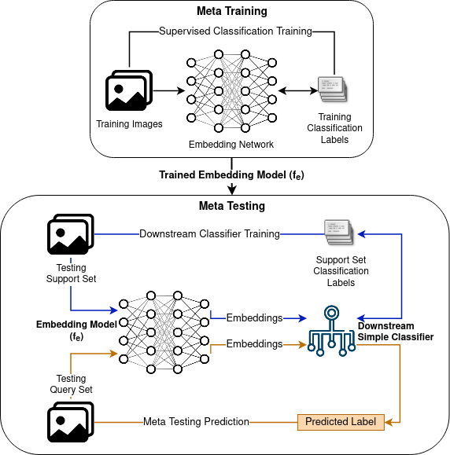

#  Few-Shot Learning for Skin Analysis

Model building, experiments, references and source-code for the research work on skin image analysis using few-shot learning. 

## Cite Us

[Link to the Research Paper Preprint](https://arxiv.org/abs/2210.16954)

If you find our work useful in your research, cite us:

```
@article{https://doi.org/10.48550/arxiv.2210.16954,
  doi = {10.48550/ARXIV.2210.16954},  
  url = {https://arxiv.org/abs/2210.16954},  
  author = {Desingu, Karthik and P., Mirunalini and Chandrabose, Aravindan},  
  keywords = {Computer Vision and Pattern Recognition (cs.CV), Artificial Intelligence (cs.AI), Machine Learning (cs.LG), FOS: Computer and information sciences, FOS: Computer and information sciences},  
  title = {Few-Shot Classification of Skin Lesions from Dermoscopic Images by Meta-Learning Representative Embeddings},  
  publisher = {arXiv},  
  year = {2022},  
  copyright = {Creative Commons Attribution 4.0 International}
}
```

## Proposed Embedding-Network & Base-Learner Approach for Meta Learning

This work proposes a two-stage approach: a baseline supervised learner on the meta-training set that allows a network to learn highly representative and generalizable feature embeddings for images, that are readily transferable to new few-shot learning tasks; positing that a representative feature embedding can be more effective than complex meta-learning algorithms, a simple linear classifiers is trained atop these representations.



## Key References

### [[CVPR-2020] Meta-DermDiagnosis Few-Shot Skin Disease Identification using Meta-Learning.pdf](./Literature/%5BCVPR-2020%5D%20Meta-DermDiagnosis%20Few-Shot%20Skin%20Disease%20Identification%20using%20Meta-Learning.pdf)

- Proposes the use of meta-learning techniques for efficient model adaptation for extremely low-data scenarios
- Applies Group equivariant convolutions (G-convolutions) in place of the normal spatial convolution filters
- Two network implementations: 
    - Reptile: Gradient-based meta-learning
    - Prototypical networks using Euclidean Distance
- Evaluated on ISIC 2018, Derm7pt and SD-198 datasets
- Outperforms DAML on ISIC 2018
- Implementation Code NOT available

### [[CVPR-2018] Learning to Compare Relation Network for Few-Shot Learning](./Literature/%5BCVPR-2018%5D%20Learning%20to%20Compare%20Relation%20Network%20for%20Few-Shot%20Learning.pdf)

- The paper that proposed Relation Networks for Few-Shot Learning

### [[NeurIPS-2017] Prototypical Networks for Few-shot Learning](./Literature/%5BNeurIPS-2017%5D%20Prototypical%20Networks%20for%20Few-shot%20Learning.pdf)

- The paper that proposed Protoypical Networks for Few-Shot Learning

### [[Elsevier-PR-2020] Temperature network for few-shot learning with distribution-aware large-margin metric](./Literature/%5BElsevier-PR-2020%5D%20Temperature%20network%20for%20few-shot%20learning%20with%20distribution-aware.pdf)

- An improvement of Prototypical Networks, by generating query-specific prototypes and thus results in local
and distribution-aware metric 
- Sets different temperature for different categories to penalize query samples that are not close enough to their belonging categories.
- *Code available - PyTorch*
